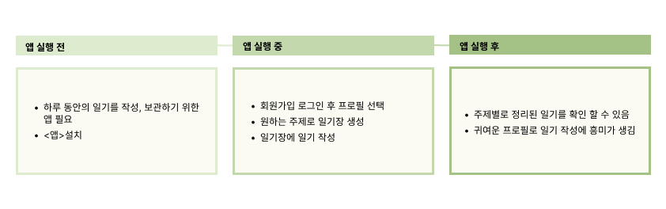

# :sunny: Team Nunettine

### [PROJECT] Nutti - Exchange diary made of react :  리액트를 이용한 ~~교환일기 앱~~ 일기장 앱 구현

> Project site: [click🌐](https://port-0-nutti-9zxht12blqemz5ik.sel4.cloudtype.app/) 
> notion site: [click🌐](https://www.notion.so/Nunettine-Team-Project-fac006bb97864857b90d41a0470e2534?pvs=4) 
> google-sheet site: [click🌐](https://docs.google.com/spreadsheets/d/1Cee6Nal3bsqyeE3vchGoPeeJEQRvkNYe9tQgVdrIvqA/edit?usp=sharing) 

#### 1. 프로젝트 개요

##### 계획 수립 및 설계

- 장소에 상관없이 어디서나 모바일로 쉽게 일상을 기록할 수 있는 일기장 구현.

##### 프로젝트 선정 이유

- ~~친구들과 일기를 기록하고 서로의 추억을 공유.~~
- 언제 어디서나 쉽게 일상을 기록하고 보관할 수 있는 일기장.
- 나만의 기록하고 싶은 주제별 일기장을 생성하여 일기를 작성.

#### 2. 기획 의도 & 목표

##### 목표

- ~~친구들과 하루를 공유하며 소통할 수 있는 앱을 구현.~~
- react를 사용한 사용자 데이터 관리의 원활한 연결 구현.
- 백앤드를 이용한 회원가입, 로그인 기능 완성.
- 프로젝트와 더불어 팀원들의 지속 가능한 동기부여로 성공 가능성을 높임.

#### 3. 작업순서

1. 프로젝트 선정
2. 요구사항 분석 및 공통 가이드라인 작성
3. 데이터 베이스 모델 정의
4. React 앱 생성
5. UI 디자인
6. 데이터 베이스 수정 및 오류 수정 작업
7. 배포 후 발표 & 보고서 작성

#### 4. 사용 기술

##### 개발 환경

1. **FRONTEND**

- **라이브러리/프레임워크:** React
- **기타 도구:** react-router-DOM
- **언어:** JavaScript / CSS

2. **BACKEND**

- **런타임환경:** Node.js
- **프레임워크:** Express, nodemon, mongoose
- **기타 도구:** express-session, cors, json, axios, sha256 이용한 비밀번호 해싱
- **배포:** cloudtype
- **Database:** mongoDB

3. **사용 프로그램**

- git / GitHub
- GitHub pages
- cloudtype
- figma
- Procreate
- Notion

#### 5. 각 담당 업무

1. 역할 분담

- 리더: 한재영(작업 기록)
- 팀원: 김신영(일러스트 작업)
- 팀원: 허수인(발표)

2. 작업 분담

- 한재영: Month / DailyDiary
- 김신영: Postiong / viewPost
- 허수인: Home / Loading / Join

#### 6. 프로젝트 내용

##### 사용자 시나리오

##### 요구사항 분석

##### 워크플로우

##### 인포메이션 아키텍처

##### 디렉토리 구조

##### 페이지 구성(와이어 프레임)

###### UI 디자인

###### 앱 구현 및 주요 기능

###### 작업 시 문제 및 해결 방법

#### 7. 프로젝트 완료 리뷰

###### 아쉬운 부분

###### 잘한 부분

###### 최종 리뷰

# :boom: Project Timeline

## 231206

#### 디렉토리 구조 설계

- 워크플로우 기준으로 작성
- 1차적 가장중요한 부분만 디렉토리 설계
- 컴포넌트 별로 조립
- 메인기능 -> 서브기능 순으로 구조설계

#### -> 피드백

- 큰 단위 / 작은 단위로 분류
- 큰 단위의 상위 컴포넌트는 'pages' 또는 'layouts'으로 정리
- 작은 단위의 조각 컴포넌트는 'componenets' 디렉토리로 분리
- assats 폴더에 css를 따로 정리하기 보다 컴포넌트 별로 정리하여 사용하는 것을 추천.
- css를 따로 폴더를 만들어 정리할 경우 사용이 불편할 수 있음
- UI 디자인 시스템 만들어서 작업 진행할 것.

#### font 선정

- 선정 fonts

1. [온글잎 의연체](https://noonnu.cc/font_page/667)
2. [봉숭아틴트](https://noonnu.cc/font_page/259)
3. [하늘보리체](https://noonnu.cc/font_page/1243)

#### 랜덤 프로필 & 다이어리 일러스트 작업

## 231205

- 요구사항 분석 정리(비기능적 내용 수정)
- 와이어 프레임 작업(피그마)
- 프로토 타입, 컬러
  - 프로토 타입 작성(레이아웃 설정)
  - 메인 컬러 설정
  - 폰트 (메인, 서브) 컬러 설정
  - 폰트 서치
- 컴포넌트, 파일트리 정리

## 231204

### 프로젝트: 교환일기

- 첫페이지 - 일기를 쓸때마다 아이콘(책) 생성
  - ex) 책장 책 한권에 한달
- 아이콘 클릭했을때 해당 글로 이동
- 해당 글에 댓글 등록 - 등록후 삭제 수정 기능추가
- 오른쪽 하단에 글쓰기 아이콘추가

### 디자인 컨셉

- 책장 - 열쇠 - 책

- 벤치마킹사이트(구현앱기능)
- 사용자시나리오
- 기술
- 유스케이스(사용성 기능 파악)
- 기능구현
- 요구사항 분석(기능적, 비기능적)
- 사용자 시나리오 작성
- ~~워크플로우 작성~~
- 현재 워크플로우를 인포메이션 아키텍쳐 형식으로 작성하여 다시 작성

## 231201

### 목표

1. 친구들과 하루를 공유하며 소통할 수 있는 앱을 구현.
2. react를 사용한 사용자 간의 원활한 연결 구현.
3. 백앤드를 이용한 회원가입, 로그인 기능 완성.

### 프로젝트 선정 이유

- 단순히 SNS를 통한 일회성 대화가 아닌, 깊은 대화를 유도할 수 있는 앱 구현.
- 일기를 기록하고 서로의 추억을 공유.
- 프로젝트와 더불어 디자인적으로 팀에서 원하는 컨셉으로 진행하며, 흥미를 가지고 지속 가능한 동기부여로 성공 가능성을 높임.

### Team : 누네띠네

- 팀 구성
  - 리더 : 한재영
  - 팀원 : 김신영, 허수인
- 역할분담
  - 작업기록자 : 한재영
  - 깃관리자 : 김신영
  - 일러스트 작업 : 김신영
  - 발표 : 허수인
