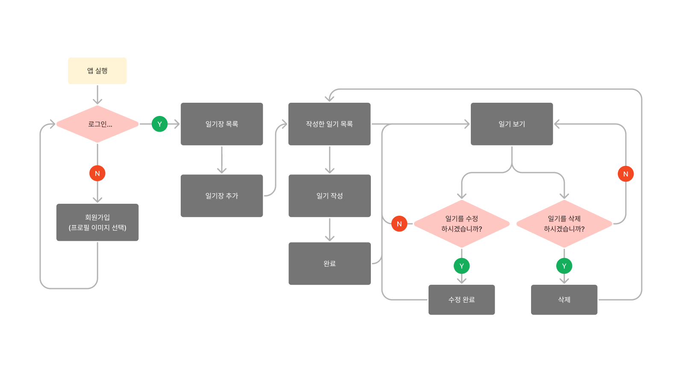
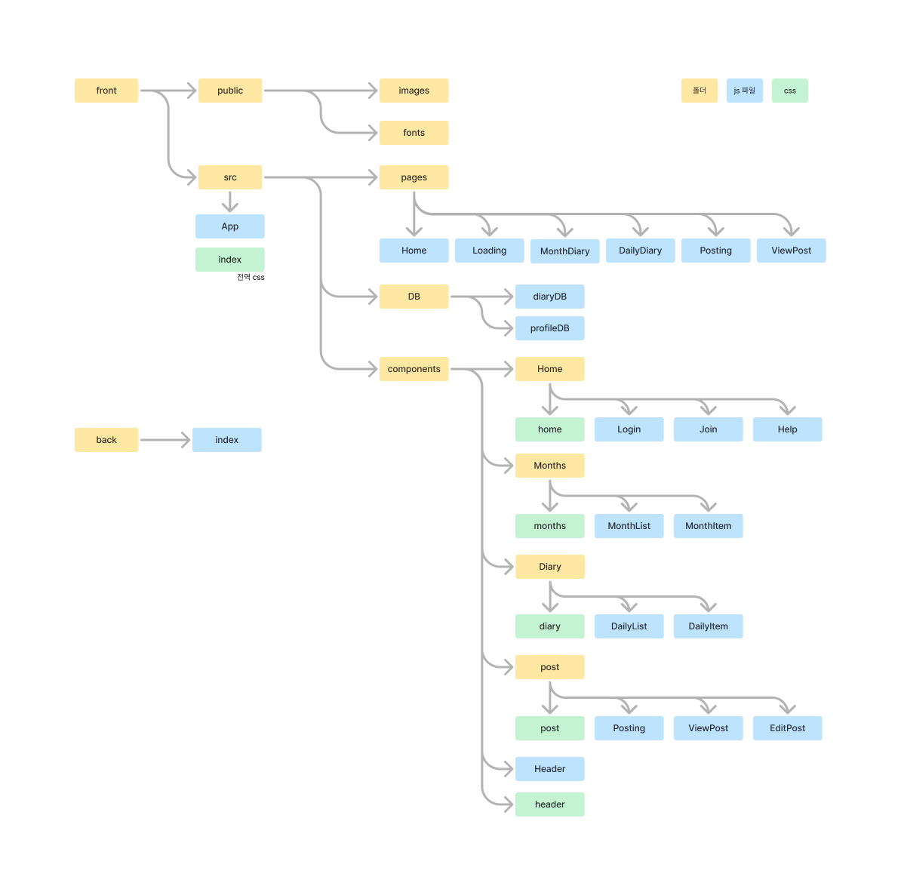
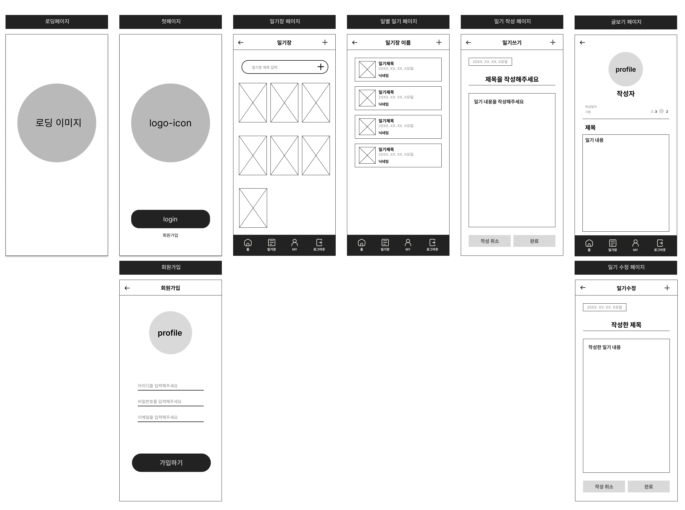
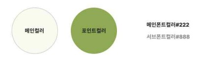
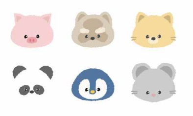
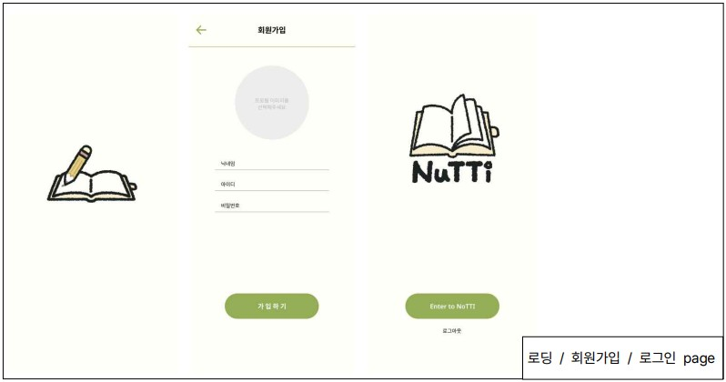
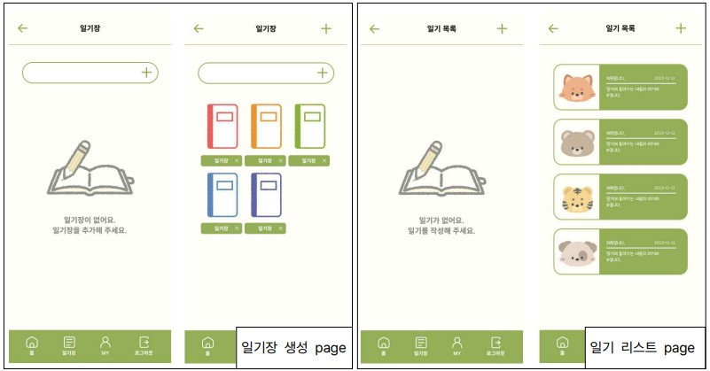
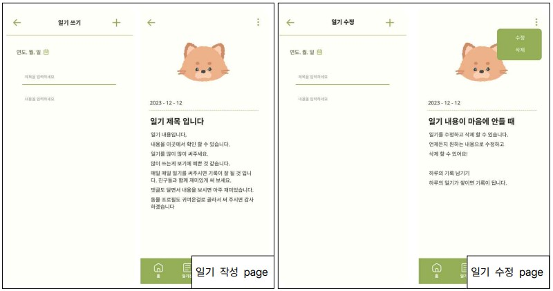

# 💌 Team Nunettine

### [PROJECT] Nutti - Exchange diary made of react :  리액트를 이용한 ~~교환일기 앱~~ 일기장 앱 구현

> Project site: [click🌐](https://port-0-nutti-9zxht12blqemz5ik.sel4.cloudtype.app/) 
> 프로젝트 완료보고서: [click🌐](https://www.notion.so/77121956dd06435eac118f13fd19750a?pvs=4) 
> 발표 PPT: [click🌐](<a href="./작업자료/project_report.pdf">) 

## 1. 프로젝트 개요

### 계획 수립 및 설계

- 주제를 정해 날짜별, 상황별 등 따로 기록 할 수 있는 일기장 구현.

### 프로젝트 선정 이유

- 일상을 나만의 주제별로 기록하고 보관할 수 있는 일기장.

## 2. 기획 의도 & 목표

### 목표

- react를 사용한 사용자 데이터 관리의 원활한 연결 구현.
- 백앤드를 이용한 회원가입, 로그인 기능 완성.
- 프로젝트와 더불어 팀원들의 지속 가능한 동기부여로 성공 가능성을 높임.

## 3. 작업순서

**1)** 프로젝트 선정 
**2)** 요구사항 분석 및 공통 가이드라인 작성 
**3)** 데이터 베이스 모델 정의 
**4)** React 앱 생성 
**5)** UI 디자인 
**6)** 데이터 베이스 수정 및 오류 수정 작업 
**7)** 배포 후 발표 & 보고서 작성 

## 4. 사용 기술

**1) FRONTEND**

- **라이브러리/프레임워크:** React
- **기타 도구:** react-router-dom
- **언어:** JavaScript

**2) BACKEND**

- Node.js
- mongoose
- axios
- express

**3) 데이터베이스**

- mongoDB

**4) 배포:**

- cloudtype

**5) 사용 프로그램**

- VSCode
- git / GitHub
- figma
- Procreate

## 5. 각 담당 업무

**1) 역할 분담**

| 역할 |  이름  |        담당         |
| :--: | :----: | :-----------------: |
| 리더 | 한재영 |      작업 기록      |
| 팀원 | 김신영 | 일러스트 / PPT 제작 |
| 팀원 | 허수인 |        발표         |

**2) 작업 분담**

|  이름  |                            담당 작업 파트                             |
| :----: | :-------------------------------------------------------------------: |
| 한재영 |       Month(일기장 모음) / DailyDiary(일별일기 모음, 일기추가)        |
| 김신영 |            Postiong(일기작성) / viewPost(작성된 일기 보기)            |
| 허수인 | Home(첫페이지) / Loading(로딩페이지) / Join(회원가입) / Login(로그인) |

## 6. 프로젝트 내용

### 사용자 시나리오

### 요구사항 분석

**1) 기능적 요구사항**

|               기능               | 기능 상세 설명                                        |
| :------------------------------: | :---------------------------------------------------- |
|         첫페이지 (Home)          | 로딩 페이지 이후 로고 이미지                          |
|                                  | 회원가입 / 로그인 페이지로 이동                       |
| 회원가입 / 로그인 (Join / Login) | 프로필 선택 / 아이디(닉네임) / 비밀번호 / 이메일 입력 |
|                                  | 가입 완료 후 첫페이지 이동                            |
|          일기장 (Month)          | 사용자 설정 일기장 추가                               |
|      일기 추가 (DailyDiary)      | 새로운 일기 추가                                      |
|       일기 작성 (Postiong)       | 날짜, 제목, 내용 입력                                 |
|   작성한 일기 보기 (viewPost)    | 작성한 일기 내용 확인, 수정 및 삭제                   |

**2) 비기능적 요구사항**

|             기능              | 기능 상세 설명                                                                                  |
| :---------------------------: | :---------------------------------------------------------------------------------------------- |
| 일러스트를 활용한 프로필 작업 | 전체적인 디자인에 어울리는 동물 일러스트를 프로필 사진으로 이용하여 사용자의 재미와 흥미를 유발 |
|        깔끔한 레이아웃        | 직관적으로 알아볼 수 있는 레이아웃 아이콘으로 구성하여 높은 편의성 요구                         |
|    자연스러운 앱 사용 흐름    | 앱이 다음 페이지로 넘어가는 경우 순서가 어색하지 않게 다음 동작이 진행되도록 페이지 구성        |

### 워크플로우

### 인포메이션 아키텍처

### 디렉토리 구조

### 페이지 구성(와이어 프레임)

### UI 디자인

**1) 디자인 컨셉**

- 귀여운 / 깔끔한 / 다이어리

**2) 메인/서브 컬러 선정**

**3) 일기장/프로필 캐릭터 일러스트**

- 일기장

- 프로필 캐릭터(총 19마리 동물 프로필)

### 앱 구현 및 주요 기능

### 작업 시 문제 및 해결 방법

**1) 기능적 오류**

**① 문제점**

- 앱을 킬때만 보여야 하는 기능이 다른 페이지에서 글 작성 후 버튼을 누르면 필요없는 로딩 페이지가 나옴.

**② 해결방법**

- 처음에 App.js에 설정해둔 로딩 기능을 Home.js 컴포넌트로 옮겨 로딩 화면을 Home으로 갈때만 보이게 하고 다른 페이지에선 안보이게 해결함.

**① 문제점**

- 일기장, 일 별 일기 페이지에선 다른 페이지로 넘어가도 데이터가 유지 되어야 하는데 useState로 작업해 새로고침 하거나 다른 페이지로 넘어가서 다시 돌아오면 데이터들이 다 날아감

**② 해결방법**

- localStorage를 사용. 키값은 inputText로 설정해서 사용자가 input에 작성한 텍스트로 생성되게 하고 새로고침 하거나 다른 페이지 넘어갔다 돌아와도 데이터가 유지되게 함.

**① 문제점**

- 헤더에 있는 기능에 들어가는 뒤로가기 버튼을 navigate 경로 문자열 -1로 작성해 뒤로 가기 기능이 실행이 안됨.

**② 해결방법**

- -값 빼고 숫자열로 수정 하니 뒤로가기 버튼이 작동됨.

**① 문제점**

- 작업 초기에 MongoDB 연결 방법을 몰라서 사용자 프로필 이미지를 랜덤하게 설정하니 일기 모음 페이지, 일기 보기 페이지, 마이페이지에서 새로고침, 버튼 클릭 등의 동작을 할 때마다 프로필 이미지가 계속 변경됨.

**② 해결방법**

- MongoDB 연결 후, 회원가입 컴포넌트에 미리 만들어둔 profileDB.js를 연결하여 모달창을 통해 프로필 이미지 선택 기능을 추가함. 백엔드에서는 회원 정보와 선택한 프로필 이미지가 유지되도록 설정. 프로필 이미지가 보여지는 컴포넌트에서 랜덤 프로필 이미지를 지정하는 로직 제거하고 구조를 다시 설정해줌.

**2) 비기능적 오류: 디자인 컨셉 불분명**

**① 문제점**

- 디자인 컨셉이 명확하지 않아 컬러가 너무 낮은 채도로 설정해 귀여운 느낌의 일러스트와 색감이 맞지 않음.

**② 해결방법**

- 색상 채도를 높여 일러스트와 잘 어울리고 귀여운 컨셉이 맞춰짐.

**① 문제점**

- 아무것도 없는 일기장 목록, 일 별 일기장 목록에선 빈공간으로 되어있다보니 자칫 오류가 생긴걸로 오해할수있음.

**② 해결방법**

- 일기장 목록, 일 별 일기장 목록에서 비어있을시엔 로고 이미지를 흐릿하게 만들고 “일기장이 없어요 일기장을 추가해주세요” 라는 문구를 추가해 밋밋함을 줄여주었고 일기장, 일기가 추가되었을땐 사라지는 기능을 추가함

# :boom: Project Timeline

## 231221

- 카페에 url 자료 업로드
- 완료보고서 작성 할 것(금요일)
- 프로젝트 완료는 화요일 전까지 수정보완 하셔라
- url로 열었을 때 문제가 되는 부분 모두 수정…

### 프로젝트 수정 사항

- [ ] 친구 초대 기능 수정
- [ ] 프로필 이미지 선택 가능
- [ ] mongoDB 연결 (일기장, 일기, 댓글)
- [ ] 수정, 삭제 기능 완성
- [ ] 일기 작성시 작성되지 않은 부분이 있으면 알람창 뜨게
- [ ] 하단 메뉴 바 추가

- **누네띠네 :교환일기 app**
  ### 질문
  - 회원가입할때 아이디와 비밀번호 실제로 구현되는지
  - 일기에 댓글쓰는기능에 사용자는 익명인지
  - 동물얼굴이 바뀌는건 의도한건지
  - 공유일기장인데 소통하는 방식이 정확히 어떻게 되는건지
  - 메뉴바는 안만들고 뒤로가기만 한건지
  - 회원가입할때 이용약관 내용은 있는데 체크하는건 왜 안했는지
  ### 피드백
  기능을 나눠서 설명한건 좋음
  제일 큰 문제사항 오늘 배운거로 수정하세요 ㅋㅋ
  교환일기 앱인데 기능이 많이 부족하다
  → 프로젝트 주제를 구현한 내용과 어울리게 변경하는 게 좋을듯
  뭐가 추가적으로??…했음좋겠다.. 하셨는데 못들음
  UI 적으로 부족함
  아무런 글이 없으면 바로 글을 쓴다거나 흐름이 자연스럽지 않다.

1. **개인 일기장으로 1차 완성**
   1. 몽고DB 이용: 일기장, 일기 리스트, 사용자 데이터 관리
   2. 사용자 프로필 이미지 선택 가능하도록 구현
   3. 일기 수정, 삭제 기능 완성
   4. 하단 메뉴바 추가하여 원활한 이동 가능하도록 구현
   5. 워크플로우 수정해서 UI디자인
   - 로그인/회원가입
   - 일기장
   - 일별일기
   - 일기 작성
   - 일기 보기
2. **교환 일기장으로 완성**
   1. 사용자 초대해서 댓글 작성이 가능하도록 구현

## 231220

### 코드 작업

- mongoDB로 데이터 관리 변경
  - 로그인
  - 회원가입
  - 일기장
  - 일기 수정 / 삭제
  - 댓글 수정 / 삭제

### 발표준비

- 피피티 제작
- 대본 작성

## 231218

### 모달창 디자인 변경

- 하단 모달창에서 3점 밑에 작은 창으로 변경
- 버튼은 글자로 입력

### 버튼 아이콘 선정

- 댓글, 댓글삭제 버튼 아이콘 선정
- 다른 버튼은 글자로 입력해서 작업하기로

## 작업 중 오류사항

- 뒤로가기 버튼 실행 안 됨 : -1 문자열로 작성해서 작동 안됨 - 문자열 빼주니(?)작동
- 일기 월 목록 추가 시 기존 리스트 + 새로운 목록이 반복해서 생겨남(map이 아닌 다른 코드가 필요할 것 으로 보여짐)→ ul 안에 있던 monthItem을 ul없이 작성, key값 idx로 설정

## 수정사항

- 수인
  - [x] ~~로그인 로그아웃 연결 (몽고디비 배우고 해결하기)~~
  - [x] 일기장에서 일기장 삭제 버튼 추가
- 재영
  - [ ] 일기 리스트 유지할 수 있도록 레지스트리로 수정
  - [ ] 일기 생성 후 뒤로가기 버튼 누르면 ‘/:monthParam’나오고 있어서 일기장 이름이 제대로 나오도록 경로 수정
- 신영
  - [ ] 일기 수정, 삭제 버튼 작동
  - [x] 컬러 일러스트로 CSS 수정

## 231215-16

## 프로젝트 진행

- 변경한 디자인 컨셉으로 css 수정
- 각자 페이지 작업

## 코드 작업 중간 점검

### 현재까지 작업 중 더 진행해야 할 부분

- [x] 로그인/회원가입 기능 구현
- [ ] 회원가입 후 로그인 페이지로 넘어가게
- [x] 로그아웃 페이지 ‘환영합니다 님’ 문구 수정(?) - ex) 로그아웃하시겠습니까?
- [x] 전체 body width값 모바일 사이즈로 고정 후 작업
- [ ] 댓글, view post 모달창 수정, 삭제 버튼 아이콘 정하기
- [ ] 댓글, 일기쓰기 페이지에서 헤더 뒤로가기 버튼 작동안함
- [ ] 내용이 작성되지 않았을 때 알람뜨게

## 중간점검 피드백

- 기능 완성 정도 : 70%됨
- 모바일 width사이즈로 고정해서 작업
- 다음주 몽고DB 배운 후 로그인, 데이터 저장 작업 진행

## 231212-13

## 작업한 프로젝트 디자인 중간점검

- 디자인 컨셉이 명확하지 않음.
- 전체적으로 작업한 아이콘이나 버튼, 텍스트 박스 등 요즘 스타일과 많이 멀다.
- 참고한 앱 디자인 보고 조금 더 연구 필요.
- 영역마다 구분이 명확하지 않아서 보기 힘들다.
- 색 채도를 높일 것. 어둡고 칙칙함… 밝은 색감으로 수정이 필요할 것 같다.

###### → 다이어리 컬러 밝게 수정

###### → 밝은 컬러로 전체적인 디자인 변경

###### → 버튼이나 아이콘 등 좀 더 심플하고 디자인적인 요소로 참고해서 수정.

## 디자인 2차 중간점검

- 여전히 채도가 너무 낮다.
- 영역이 더 확실히 구분이 되면 좋겠다. (특히 버튼)
- 차라리 다크모드로 가거나 아예 밝게 가는게 좋을것같다

###### → 컬러 다 빼고 블랙 앤 화이트로 변경

###### → 일러스트 아웃라인으로 수정

## 코드 작업 중간 점검

- 현재까지 작업 중 더 진행해야 할 부분
- 한재영
  - 하위 컴포넌트로 프롬포트 전달하여 리스트 유지하기
  - 월 일기장 생성 시 다이어리 일러스트 나오게 하기
  - 일기 목록 컴포넌트가 현재 두개로 보여서 하나로 정리하기
- 허수인
  - Comment 페이지 구조 다시 짜기 (댓글 작성하고 버튼을 누르면 리스트 처럼 나와야 하는데 안나옴)
  - Loading, Home 페이지 이미지 로고 가운데 맞추기
- 김신영
  - 일기 삭제, 수정 기능 추가
  - 일러스트 흑백으로 수정
  - 일기 목록에서 제목, 내용이 많아지면 줄임표(…)로 표시되게
  - 일기 보기에서 줄바꿈 표시되게
  - 헤더 컴포넌트별로 내용이 변경되게
  - 헤더에 이전버튼 활성화

## 231211

### 작업 시 문제점 및 해결 사항

- 지금까지 작업한 개별 작업 한파일로 합쳐서 확인.

###### → 합치는 작업에서 큰 특이사항은 없었음.

- 한재영
  - 컴퍼넌트 이동 후 돌아왔을 때 생성된 list data가 날라감.
  - useState → redux로 변경하여 상태전역으로 작업하려 했으나, map을 돌리는데 문제가 생김.
    → 선생님 help
  - useState를 사용해도 문제 없음.
  - props가 제대로 전달이 안되서 그런 것 같다고 하셔서 수정 필요.
  - redux보다는 redux toolkit 추천.
  - 데이터가 저장되어야하는 부분이라 나중에 몽고디비가 필요할 것으로 보인다고 하심.
  - 추가 수정사항
    - [x] 다이어리 일러스트 리스트 보이게 작업하기
    - [x] 디자인 css 작업
- 허수인
  - 댓글 페이지에서 댓글을 달고 버튼을 누르면 필요없는 로딩화면이 나옴.
  - 로딩페이지가 보이게 하는 기능을 App.js에 연결해서 그런거같다고 하심
  - 로딩페이지 나오게 하는기능을 맨 처음에만 보이게 할려면 Home에 주는방법도 있다고 하심
  - 로딩페이지가 나오는 기능을 App.js에 둔걸 Home.js에 두어 Home으로 갈때만 보이고 다른 페이지에서는 안보이게 해결함.
  - MonthDiary컴포넌트에서 새로 생긴 일기장 마다 있는 삭제버튼이 없어 모달창 만들어 구현하려 했지만 해결이 안되서 처음부터 리스트마다 삭제버튼을 넣어서 버튼의 크기를 작게 만들어 눈에띄지 않게 css작업 이용해서 수정해야함.

## 231207

#### 퍼블리싱 가이드라인 작성

#### 작업 역할 분담

- 작업 시작은 GitHub 파일로 초기 세팅
- 각자 담당 컴포넌트 분담 후, 로컬로 작업 진행. (추후 합치기로)

## 231206

#### 디렉토리 구조 설계

- 워크플로우 기준으로 작성
- 1차적 가장중요한 부분만 디렉토리 설계
- 컴포넌트 별로 조립
- 메인기능 -> 서브기능 순으로 구조설계

#### -> 피드백

- 큰 단위 / 작은 단위로 분류
- 큰 단위의 상위 컴포넌트는 'pages' 또는 'layouts'으로 정리
- 작은 단위의 조각 컴포넌트는 'componenets' 디렉토리로 분리
- assats 폴더에 css를 따로 정리하기 보다 컴포넌트 별로 정리하여 사용하는 것을 추천.
- css를 따로 폴더를 만들어 정리할 경우 사용이 불편할 수 있음
- UI 디자인 시스템 만들어서 작업 진행할 것.

#### font 선정

- 선정 fonts

1. [봉숭아틴트](https://noonnu.cc/font_page/259)
2. ~~[온글잎 의연체](https://noonnu.cc/font_page/667)~~
3. ~~[하늘보리체](https://noonnu.cc/font_page/1243)~~

#### 랜덤 프로필 & 다이어리 일러스트 작업

## 231205

- 요구사항 분석 정리(비기능적 내용 수정)
- 와이어 프레임 작업(피그마)
- 프로토 타입, 컬러
  - 프로토 타입 작성(레이아웃 설정)
  - 메인 컬러 설정
  - 폰트 (메인, 서브) 컬러 설정
  - 폰트 서치
- 컴포넌트, 파일트리 정리

## 231204

### 프로젝트: 교환일기

- 첫페이지 - 일기를 쓸때마다 아이콘(책) 생성
  - ex) 책장 책 한권에 한달
- 아이콘 클릭했을때 해당 글로 이동
- 해당 글에 댓글 등록 - 등록후 삭제 수정 기능추가
- 오른쪽 하단에 글쓰기 아이콘추가

### 디자인 컨셉

- 책장 - 열쇠 - 책

- 벤치마킹사이트(구현앱기능)
- 사용자시나리오
- 기술
- 유스케이스(사용성 기능 파악)
- 기능구현
- 요구사항 분석(기능적, 비기능적)
- 사용자 시나리오 작성
- ~~워크플로우 작성~~
- 현재 워크플로우를 인포메이션 아키텍쳐 형식으로 작성하여 다시 작성

## 231201

### 목표

1. 친구들과 하루를 공유하며 소통할 수 있는 앱을 구현.
2. react를 사용한 사용자 간의 원활한 연결 구현.
3. 백앤드를 이용한 회원가입, 로그인 기능 완성.

### 프로젝트 선정 이유

- 단순히 SNS를 통한 일회성 대화가 아닌, 깊은 대화를 유도할 수 있는 앱 구현.
- 일기를 기록하고 서로의 추억을 공유.
- 프로젝트와 더불어 디자인적으로 팀에서 원하는 컨셉으로 진행하며, 흥미를 가지고 지속 가능한 동기부여로 성공 가능성을 높임.

### Team : 누네띠네

- 팀 구성
  - 리더 : 한재영
  - 팀원 : 김신영, 허수인
- 역할분담
  - 작업기록자 : 한재영
  - 깃관리자 : 김신영
  - 일러스트 작업 : 김신영
  - 발표 : 허수인
